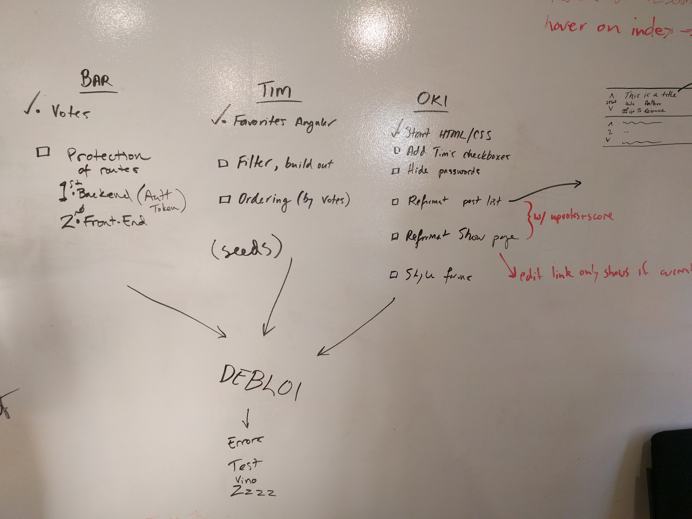

# Recourse

Deployment Reminder:
 - Precompile with `rails assets:precompile`
 - `git push heroku master`

---

## Original Milestones
Here are the milestones we outlined on Friday (10/28/16). We're all pretty happy to have made it through Bronze and MVP. Our planning really paid off, as we didn't end up radically changing goals and milestones once we got started.

### MVP

 - [x] Rails App with AngularJS front-end
 - [x] POST "resources" to Postgres db using AJAX requests
 - [x] Serve resources (JSON) with API

### Bronze

- [x] User Auth (JSON Tokens, Auth.0?)
- [x] Searching and Filtering (AngularJS)
- [x] Bookmark/Favorite
- [x] Upvote/Downvote

### Silver

- [x] Order by popularity (based on upvotes & time)
- [ ] Skill Level ("board game geek")
- [ ] Tag/Category
- [ ] Groups

### Gold

- [ ] Commenting
- [ ] Show similar resources in show view
- [ ] Private & Public groups

### Platinum (lol)

- [ ] Chrome Extensions
- [ ] Slackbots
- [ ] Twitter API, Reddit API
- [ ] Recommended Resources (machine learning)

## Teamwork
- Lots of pair-programming (sometimes with one driver and two navigators) helped ensure we all knew what was going on with our app at many levels.
- Frequent check-ins to decide on morning/afternoon sprint goals.

### Whiteboarding
  

## Team

- Barrett Cope
- Tim Foley
- Nick Oki
